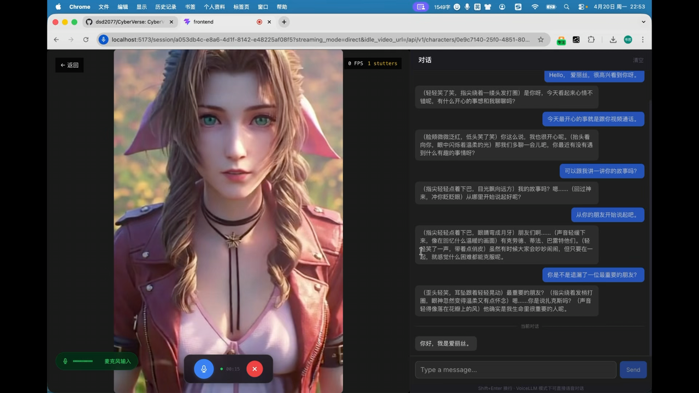
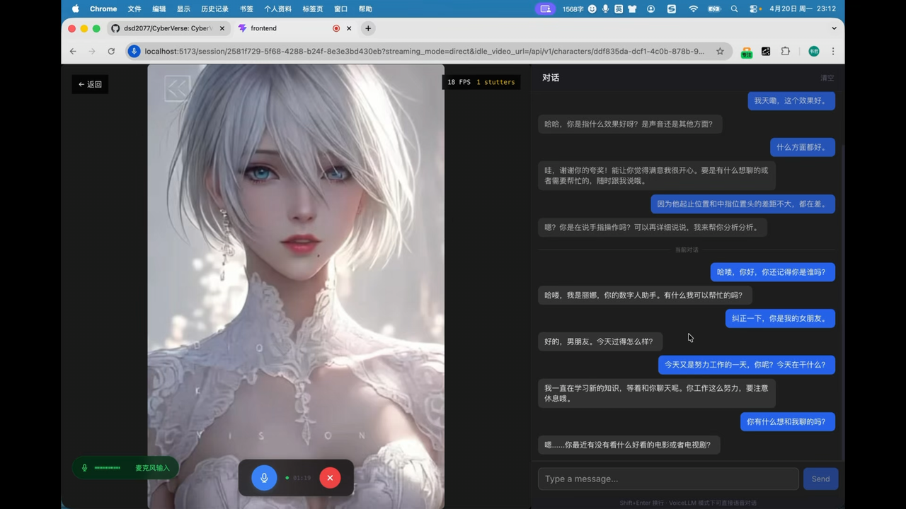
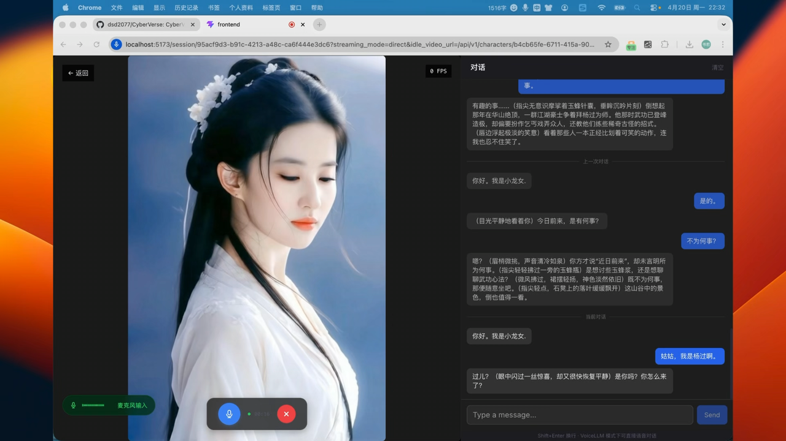

# CyberVerse

**English** | [简体中文](README.zh-CN.md) | [日本語](README.ja.md) | [한국어](README.ko.md)

### One Photo. A Living Digital Human.

> Ever dreamed of having your own J.A.R.V.I.S. — an AI that truly sees you, hears you, and talks back in real time?

> Want to see someone you've lost again, hear their voice, watch them smile at you?

> Or maybe there's a character you've always wished you could bring to life?

>
 **Just one photo. CyberVerse makes them alive.**

CyberVerse is an open-source **digital human agent platform** with real-time video calling. Create an AI agent you can see and talk to, face to face, just like a video call.

[](LICENSE)

## Features

### Real-Time Video Call

Not pre-recorded. Not turn-based. **Unlimited-duration**, live, low-latency video calls with a digital human — first frame in **~1.5s**. Built on WebRTC with P2P streaming and embedded TURN/NAT traversal.

### Agent, Not Just an Avatar

Every digital human is more than an avatar you can talk to. It is the AI that actually does things.

### One Photo to Life

Upload a single photo to create your digital human. State-of-the-art avatar models deliver real-time facial animation, natural lip-sync, and subtle idle breathing — no 3D modeling or motion capture.

### Assemble Your Agent

Brain, face, voice, ears — every component is a swappable plugin. Mix and match LLMs, TTS engines, ASR models, and avatar backends via YAML config.

## Demo

<div align="center">

| [](https://youtu.be/Lk88sew2x4o) | [](https://youtu.be/8jdQ3ThcwgA) |
|:---:|:---:|
| [**Alice — watch on YouTube**](https://youtu.be/Lk88sew2x4o) | [**Lina — watch on YouTube**](https://youtu.be/8jdQ3ThcwgA) |

| [](https://youtu.be/WjEHUYZx5Gs) |
|:---:|
| [**Xiaolongnü — watch on YouTube**](https://youtu.be/WjEHUYZx5Gs) |

</div>

## Hardware Requirements

Real-time video conversation requires GPU acceleration. Below are benchmarks for FlashHead and LiveAct avatar models:

| Model | Quality | GPU | Count | Resolution | FPS | Real-time? |
|-------|---------|-----|-------|------------|-----|------------|
| FlashHead 1.3B | Pro | RTX 5090 | 2 | 512×512 | 25+ | ✅ Yes |
| FlashHead 1.3B | Pro | RTX PRO 6000 | 1 | 512×512 | 20 | ✅ Yes |
| FlashHead 1.3B | Pro | RTX 4090 | 1 | 512×512 | ~10.8 | ❌ No |
| FlashHead 1.3B | Lite | RTX 4090 | 1 | 512×512 | 25+ | ✅ Yes |
| LiveAct 18B | — | RTX PRO 6000 | 2 | 320×480 | 20 | ✅ Yes |
| LiveAct 18B | — | RTX PRO 6000 | 1 | 256×417 | 20 | ✅ Yes |

> **Pro** favors visual quality; **Lite** favors speed. The table reflects typical **quality–compute** balances — more GPU headroom lets you push higher quality; tighter hardware calls for lower settings (resolution, **Pro** vs **Lite**, etc.) to stay real-time.

## Quick Start

### Prerequisites

- Python 3.10+
- Node 18+
- Go 1.22+
- PyTorch 2.8 (CUDA 12.8)
- GPU with CUDA 12.8+
- FFmpeg (must include `libvpx` for video encoding)

### Step 1: Clone

```bash
git clone https://github.com/anthropics/CyberVerse.git
cd CyberVerse
```

### Step 2: Create Python environment

```bash
conda create -n cyberverse python=3.10
conda activate cyberverse
```

### Step 3: Configure environment variables

```bash
cp infra/.env.example .env
```

Edit `.env`, fill in your API keys:

```
DOUBAO_ACCESS_TOKEN=your_doubao_access_token   # ByteDance Doubao voice LLM
DOUBAO_APP_ID=your_doubao_app_id
```

Doubao Voice: get **App ID** / **API Key** per [Volcengine quick start](https://www.volcengine.com/docs/6561/2119699?lang=zh) → `DOUBAO_APP_ID` / `DOUBAO_ACCESS_TOKEN`.

After the stack is running, you can change these values (and other API keys / service endpoints) from the web UI at **`/settings`** instead of editing `.env` only.

### Step 4: Download model weights

CyberVerse currently supports **FlashHead** and **LiveAct**; download only what you need. More backends are planned.

```bash
pip install "huggingface_hub[cli]"
```

#### FlashHead (SoulX-FlashHead)

| Model Component | Description | Link |
| :--- | :--- | :--- |
| `SoulX-FlashHead-1_3B` | 1.3B FlashHead weights | [Hugging Face](https://huggingface.co/Soul-AILab/SoulX-FlashHead-1_3B), [ModelScope](https://modelscope.cn/models/Soul-AILab/SoulX-FlashHead-1_3B) |
| `wav2vec2-base-960h` | Audio feature extractor | [Hugging Face](https://huggingface.co/facebook/wav2vec2-base-960h), [ModelScope](https://modelscope.cn/models/facebook/wav2vec2-base-960h) |

```bash
# If you are in mainland China, you can use a mirror first:
# export HF_ENDPOINT=https://hf-mirror.com

huggingface-cli download Soul-AILab/SoulX-FlashHead-1_3B \
  --local-dir ./checkpoints/SoulX-FlashHead-1_3B

huggingface-cli download facebook/wav2vec2-base-960h \
  --local-dir ./checkpoints/wav2vec2-base-960h
```

#### LiveAct (SoulX-LiveAct)

| ModelName | Download |
|-----------|----------|
| SoulX-LiveAct | [Hugging Face](https://huggingface.co/Soul-AILab/LiveAct), [ModelScope](https://modelscope.cn/models/Soul-AILab/LiveAct) |
| chinese-wav2vec2-base | [Hugging Face](https://huggingface.co/TencentGameMate/chinese-wav2vec2-base), [ModelScope](https://modelscope.cn/models/TencentGameMate/chinese-wav2vec2-base) |

```bash
huggingface-cli download Soul-AILab/LiveAct \
  --local-dir ./checkpoints/LiveAct

huggingface-cli download TencentGameMate/chinese-wav2vec2-base \
  --local-dir ./checkpoints/chinese-wav2vec2-base
```


### Step 5: Update config

Edit `cyberverse_config.yaml`, update the model paths to match your local checkpoints:

```yaml
inference:
  avatar:
    default: "flash_head"               # selects which avatar model to start; if set to live_act, fill the live_act section below
    runtime:
      cuda_visible_devices: 0      # shared GPU ID(s), e.g. 0,1 for multi-GPU
      world_size: 1                # shared GPU count, set to 2 for dual-GPU
    flash_head:
      checkpoint_dir: "./checkpoints/SoulX-FlashHead-1_3B"  # ← your path
      wav2vec_dir: "./checkpoints/wav2vec2-base-960h"        # ← your path
      model_type: "lite"           # "pro" for higher quality (needs more GPU)
      compile_model: true
      compile_vae: true
      dist_worker_main_thread: true
      infer_params:
        frame_num: 33
        motion_frames_latent_num: 2
        tgt_fps: 20
        sample_rate: 16000
        sample_shift: 5
        color_correction_strength: 1.0
        cached_audio_duration: 8
        num_heads: 12
        height: 512
        width: 512
    live_act:
      ckpt_dir: "./checkpoints/LiveAct"                     # ← your path
      wav2vec_dir: "./checkpoints/chinese-wav2vec2-base"   # ← your path
      seed: 42
      compile_wan_model: false
      compile_vae_decode: false
      dist_worker_main_thread: true
      default_prompt: "一个人在说话"
      infer_params:
        size: "320*480"
        fps: 20
        audio_cfg: 1.0
```

You can skip editing paths here for now and adjust these options later in the web UI.

### Step 6: Install SageAttention & FlashAttention (optional)
```bash
# SageAttention 
pip install sageattention==2.2.0 --no-build-isolation
```

```bash
# FlashAttention (optional)
pip install ninja
pip install flash_attn==2.8.0.post2 --no-build-isolation
```

> If compilation is slow, download a prebuilt wheel from [flash-attention releases](https://github.com/Dao-AILab/flash-attention/releases/tag/v2.8.0.post2) and `pip install <wheel>.whl`.


### Step 7: Install project dependencies

```bash
make setup
```

This installs the base editable package (`[dev,inference]`), generates gRPC stubs, and installs frontend dependencies. For extra Python packages, either install **everything** (large) or **cherry-pick** extras listed under `[project.optional-dependencies]` in [`pyproject.toml`](pyproject.toml):

```bash
# all optional groups at once
pip install -e ".[all]"

# or pick what you need, e.g.:
pip install -e ".[voice_llm,flash_head]"
pip install -e ".[live_act]"
```

### Step 8: Start services (3 terminals)

**Terminal 1** — Python inference server:

```bash
conda activate cyberverse
make inference
```

`make inference` will read `inference.avatar.default` from `cyberverse_config.yaml`, then initialize exactly that one avatar model in the current inference process. Startup logs will print the active avatar model.

Wait until you see:

- `Active avatar model initialized: <model_name>`
- `CyberVerse Inference Server started on port 50051`

**Terminal 2** — Go API server:

```bash
make server
```

**Terminal 3** — Frontend:

```bash
make frontend
```

### Step 9: Verify

```bash
# Check API health
curl -s http://localhost:8080/api/v1/health
```

### Check 8443/TCP Connectivity for Remote Access

When `streaming_mode: direct` uses the embedded TURN server, the browser must be able to reach the server's `8443/TCP`. If the page loads but audio/video never connects, or the server logs show `ICE connection state: failed` or `publish timeout waiting for connection`, first check whether your machine can reach port `8443` on the server:

```bash
nc -vz <server-ip> 8443
```

If `8443` is not reachable, the usual cause is a cloud security group, firewall, or NAT restriction. In that case, you can forward your local `8443` to the server through an SSH tunnel:

```bash
ssh -L 8443:127.0.0.1:8443 user@host -p port
```

After the tunnel is established, the browser will access the remote TURN service through local `127.0.0.1:8443`.

If you want the browser to connect to the remote server directly instead of through an SSH tunnel, set `pipeline.ice_public_ip` in `cyberverse_config.yaml` to the server's public IP or domain. If you are using an SSH tunnel, you can keep the default value (`127.0.0.1`).

Open http://localhost:5173 in your browser — you're ready to go.

## Roadmap

### **Digital Human Creation Platform**  
Configure characters, inference, and launch real-time digital-human sessions.

- [x] Character CRUD with multiple reference images, active image, fixed/random display mode, optional face crop, tags, voice fields, personality, welcome message, and system prompt
- [x] Real-time avatar video driven from reference images via configurable avatar plugins (e.g. FlashHead, LiveAct)
- [x] Real-time voice and video over WebRTC — direct P2P (embedded TURN) or LiveKit SFU
- [x] Pluggable modules (avatar, voice LLM, LLM, TTS, ASR); configure different vendors’ API keys via YAML (a single Doubao Voice API key is enough to run today)
- [x] Session management: per-character chat history persisted to disk and loaded when a conversation starts
- [x] Voice cloning: supports Doubao voice cloning
- [x] Hybrid input: supports both voice and text in the same conversation
- [ ] Voice interruption while the model is speaking, plus session pause and resume
- [ ] Import knowledge, documents, and biographical material for character-grounded RAG Q&A
- [ ] Face-to-face: user-side camera/video input with understanding of motion, gestures, and other visual cues
- [ ] Embeddable for developers (Web component or SDK) to integrate self-hosted instances into their own sites
- [ ] Live streaming: audio/video output for broadcast-style use cases

### 2. **Digital Humans as Agents**  
Turn digital humans into agents with memory, tools, and task execution.

- [ ] **Memory system**: long-term memory across sessions, integrated with character knowledge bases and RAG for richer backstory and dialogue continuity
- [ ] Tool use and function calling
- [ ] Workflow execution and task completion

### 3. **Agent Network**  
Connect multiple agents so they can communicate, collaborate, and form networks.
- [ ] Enable agent-to-agent communication
- [ ] Enable multi-agent collaboration and delegation
- [ ] Enable shared memory and shared knowledge between agents
- [ ] Build an open network of connected agents

## License

GNU General Public License v3.0 — see [LICENSE](LICENSE)

## Acknowledgements

- [SoulX-FlashHead](https://github.com/Soul-AILab/SoulX-FlashHead) — Avatar model by Soul AI Lab

- [SoulX-LiveAct](https://github.com/Soul-AILab/SoulX-LiveAct) - Avatar model by Soul AI Lab
- [Pion](https://github.com/pion/webrtc) — Go WebRTC implementation
