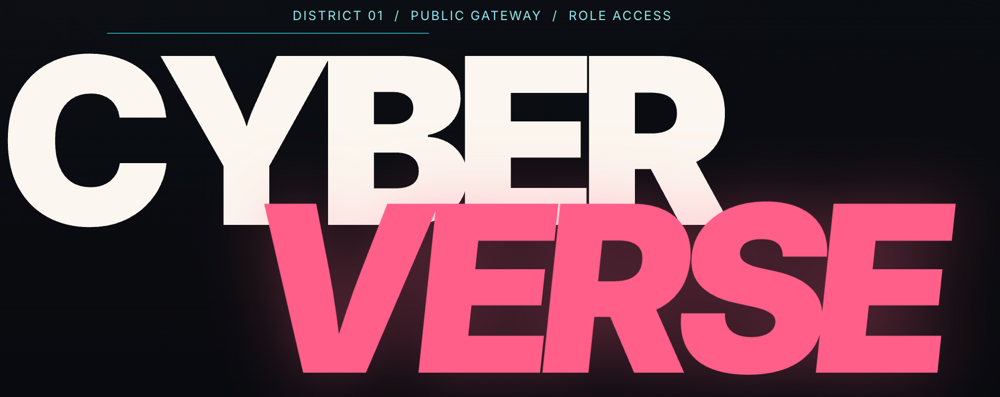

<h1 align="center">CyberVerse</h1>
<p align="center"><em>CyberVerse 是开源的<strong>数字人智能体平台</strong>，支持实时视频通话。你可以创建一个能看、能听、能面对面交流的 AI 智能体，体验与真实视频通话无异。</em></p>

<p align="center">
  <a href="README.md">English</a> · <a href="README.zh-CN.md"><strong>简体中文</strong></a> · <a href="README.ja.md">日本語</a> · <a href="README.ko.md">한국어</a>
</p>

<p align="center">
  <a href="LICENSE"></a>
  <a href="https://github.com/dsd2077/CyberVerse/pulls"></a>
</p>

<p align="center">
  <a href="docs/assets/logo.png"></a>
</p>

---

### 一张照片，让数字人真正「活」起来。

> 你是否想过拥有一个属于自己的 J.A.R.V.I.S.——能真正看见你、听见你、陪伴你的 AI？
>
> 想再次见到思念之人，听见 TA 的声音，看见 TA 对你微笑？
>
> 又或者，你一直想把某个角色带到现实世界中？
>
> **只需一张照片，CyberVerse 就能让 TA 「活」过来。**

## 功能特性

### 实时视频通话

不是预录视频，也不是回合制交互，而是与数字人进行**无限时长**、**低延迟**的实时视频通话，首帧约 **1.5 秒**。底层基于 WebRTC，支持 P2P 流传输，并内置 TURN / NAT 穿透能力。

### 数字人即 Agent

数字人不只是一个能和你对话的形象，更是一个真正能帮你做事的 AI。

### 一张照片即可生成

上传一张照片即可创建数字人。由行业最新的数字人模型提供实时面部动画、自然口型同步与待机呼吸感，无需 3D 建模或动作捕捉。

### 自由组装你的 Agent

大脑、面孔、声音、听觉——各模块可插拔。通过 YAML 即可组合 LLM、TTS、ASR 与 Avatar 后端。

## 演示

<div align="center">

| [](https://youtu.be/Lk88sew2x4o) | [](https://youtu.be/8jdQ3ThcwgA) |
|:---:|:---:|
| [**爱丽丝 — 在 YouTube 观看**](https://youtu.be/Lk88sew2x4o) | [**丽娜 — 在 YouTube 观看**](https://youtu.be/8jdQ3ThcwgA) |

| [](https://youtu.be/WjEHUYZx5Gs) |
|:---:|
| [**小龙女 — 在 YouTube 观看**](https://youtu.be/WjEHUYZx5Gs) |

</div>

## 硬件要求

实时视频对话需要 GPU 加速。下表为 FlashHead 和 LiveAct 数字人模型的性能基准：

| 模型 | 档位 | GPU | 数量 | 分辨率 | FPS | 实时运行？ |
|-------|---------|-----|-------|------------|-----|------------|
| FlashHead 1.3B | Pro | RTX 5090 | 2 | 512×512 | 25+ | ✅ 是 |
| FlashHead 1.3B | Pro | RTX 4090 | 1 | 512×512 | ~10.8 | ❌ 否 |
| FlashHead 1.3B | Pro | RTX PRO 6000 | 1 | 512×512 | 20 | ✅ 是 |
| FlashHead 1.3B | Lite | RTX 4090 | 1 | 512×512 | 25+ | ✅ 是 |
| LiveAct 18B | — | RTX PRO 6000 | 1 | 256×417 | 20 | ✅ 是 |
| LiveAct 18B | — | RTX PRO 6000 | 2 | 320×480 | 20 | ✅ 是 |

> **Pro** 偏重画质；**Lite** 偏重速度。表中配置体现画质与算力的大致平衡——算力更充裕时可进一步提高画质；算力不足时请降低画质相关选项（分辨率、Pro / Lite 档位等）以保持实时流畅。

## 快速开始

### 前置条件

- Python 3.10+
- Node 18+
- Go 1.22+
- PyTorch 2.8（CUDA 12.8）
- 支持 CUDA 12.8+ 的 GPU
- FFmpeg（需包含 `libvpx`，用于视频编码）

### 第 1 步：克隆仓库

```bash
git clone https://github.com/dsd2077/CyberVerse.git
cd CyberVerse
```

### 第 2 步：创建 Python 环境

```bash
conda create -n cyberverse python=3.10
conda activate cyberverse
```

### 第 3 步：配置环境变量

```bash
cp infra/.env.example .env
```

编辑 `.env`，填入你的 API Key：

```
DOUBAO_ACCESS_TOKEN=your_doubao_access_token   # ByteDance Doubao 语音 LLM
DOUBAO_APP_ID=your_doubao_app_id
```

豆包语音：按 [火山引擎快速入门](https://www.volcengine.com/docs/6561/2119699?lang=zh) 获取 **App ID** / **API Key**，填入 `DOUBAO_APP_ID` / `DOUBAO_ACCESS_TOKEN`。

服务启动后，你也可以在 Web UI 的 **`/settings`** 页面修改这些值（以及其他 API Key / 服务端点），而不必只依赖编辑 `.env`。

### 第 4 步：下载模型权重

CyberVerse 目前支持 **FlashHead** 与 **LiveAct** 两套模型，按需下载即可；后续还将支持更多。

```bash
pip install "huggingface_hub[cli]"
```

#### FlashHead（SoulX-FlashHead）

| 模型组件 | 说明 | 链接 |
| :--- | :--- | :--- |
| `SoulX-FlashHead-1_3B` | 1.3B FlashHead 权重 | [Hugging Face](https://huggingface.co/Soul-AILab/SoulX-FlashHead-1_3B) |
| `wav2vec2-base-960h` | 音频特征提取器 | [Hugging Face](https://huggingface.co/facebook/wav2vec2-base-960h), [ModelScope](https://modelscope.cn/models/facebook/wav2vec2-base-960h) |

```bash
# 如果你在中国大陆，可以先使用镜像：
# export HF_ENDPOINT=https://hf-mirror.com

huggingface-cli download Soul-AILab/SoulX-FlashHead-1_3B \
  --local-dir ./checkpoints/SoulX-FlashHead-1_3B

huggingface-cli download facebook/wav2vec2-base-960h \
  --local-dir ./checkpoints/wav2vec2-base-960h
```

#### LiveAct（SoulX-LiveAct）

| 模型名称 | 下载 |
|-----------|----------|
| SoulX-LiveAct | [Hugging Face](https://huggingface.co/Soul-AILab/LiveAct), [ModelScope](https://modelscope.cn/models/Soul-AILab/LiveAct) |
| chinese-wav2vec2-base | [Hugging Face](https://huggingface.co/TencentGameMate/chinese-wav2vec2-base), [ModelScope](https://modelscope.cn/models/TencentGameMate/chinese-wav2vec2-base) |

```bash
huggingface-cli download Soul-AILab/LiveAct \
  --local-dir ./checkpoints/LiveAct

huggingface-cli download TencentGameMate/chinese-wav2vec2-base \
  --local-dir ./checkpoints/chinese-wav2vec2-base
```


### 第 5 步：更新配置

编辑 `cyberverse_config.yaml`，将模型路径更新为你的本地 checkpoint 路径：

```yaml
inference:
  avatar:
    default: "flash_head"               # 指定启动的数字人模型；若设为 live_act，请填写下方 live_act 配置
    runtime:
      cuda_visible_devices: 0      # 共享 GPU ID，例如多卡可写 0,1
      world_size: 1                # 共享 GPU 数量，双卡时设为 2
    flash_head:
      checkpoint_dir: "./checkpoints/SoulX-FlashHead-1_3B"  # ← 你的路径
      wav2vec_dir: "./checkpoints/wav2vec2-base-960h"        # ← 你的路径
      model_type: "lite"           # 如需更高画质可设为 "pro"（需要更多 GPU）
      compile_model: true
      compile_vae: true
      dist_worker_main_thread: true
      infer_params:
        frame_num: 33
        motion_frames_latent_num: 2
        tgt_fps: 20
        sample_rate: 16000
        sample_shift: 5
        color_correction_strength: 1.0
        cached_audio_duration: 8
        num_heads: 12
        height: 512
        width: 512
    live_act:
      ckpt_dir: "./checkpoints/LiveAct"                     # ← 你的路径
      wav2vec_dir: "./checkpoints/chinese-wav2vec2-base"   # ← 你的路径
      seed: 42
      compile_wan_model: false
      compile_vae_decode: false
      dist_worker_main_thread: true
      default_prompt: "一个人在说话"
      infer_params:
        size: "320*480"
        fps: 20
        audio_cfg: 1.0
```

你也可以先跳过这里的路径编辑，稍后再在 Web UI 中调整这些选项。

### 第 6 步：安装 SageAttention 和 FlashAttention（可选）

```bash
# SageAttention
pip install sageattention==2.2.0 --no-build-isolation
```

```bash
# FlashAttention（可选）
pip install ninja
pip install flash_attn==2.8.0.post2 --no-build-isolation
```

> 如果编译很慢，可以从 [flash-attention releases](https://github.com/Dao-AILab/flash-attention/releases/tag/v2.8.0.post2) 下载预编译 wheel，然后执行 `pip install <wheel>.whl`。


### 第 7 步：安装项目依赖

```bash
make setup
```

这一步会安装基础可编辑包（`[dev,inference]`）、生成 gRPC stubs，并安装前端依赖。若你还需要额外的 Python 包，可以选择一次安装**全部**（体积较大），或按需安装 [`pyproject.toml`](pyproject.toml) 中 `[project.optional-dependencies]` 列出的可选组：

```bash
# 一次安装全部可选组
pip install -e ".[all]"

# 或按需选择，例如：
pip install -e ".[voice_llm,flash_head]"
pip install -e ".[live_act]"
```

### 第 8 步：启动服务（3 个终端）

**终端 1** — Python 推理服务：

```bash
conda activate cyberverse
make inference
```

`make inference` 会读取 `cyberverse_config.yaml` 中的 `inference.avatar.default`，并且只在当前推理进程中初始化该一个 Avatar 模型。启动日志会打印当前激活的 Avatar 模型名称。

等待日志中出现：

- `Active avatar model initialized: <model_name>`
- `CyberVerse Inference Server started on port 50051`

**终端 2** — Go API 服务：

```bash
make server
```

**终端 3** — 前端：

```bash
make frontend
```

### 第 9 步：验证

```bash
# 检查 API 健康状态
curl -s http://localhost:8080/api/v1/health
```

### 远程访问时检查 8443/TCP 连通性

当 `streaming_mode: direct` 且使用内嵌 TURN 时，浏览器必须能够访问服务端的 `8443/TCP`。如果页面可以打开，但音视频始终无法建立连接，或者服务端日志中出现 `ICE connection state: failed`、`publish timeout waiting for connection`，请先在本机检查与服务器 `8443` 端口是否连通，例如：

```bash
nc -vz <server-ip> 8443
```

如果 `8443` 不可达，通常是云安全组、防火墙或 NAT 限制导致。此时可以通过 SSH 隧道将本机 `8443` 转发到服务器：

```bash
ssh -L 8443:127.0.0.1:8443 user@host -p port
```

建立隧道后，浏览器会通过本机 `127.0.0.1:8443` 转发访问远端 TURN 服务。

如果你不是通过 SSH 隧道访问，而是希望浏览器直接连接远端服务器，请将 `cyberverse_config.yaml` 中的 `pipeline.ice_public_ip` 设置为服务器的公网 IP 或域名；如果使用 SSH 隧道，可以保持默认值（`127.0.0.1`）。

在浏览器中打开 http://localhost:5173，即可开始使用。

## 路线图

### **数字人创建平台**
配置角色、推理参数，并启动实时数字人会话。

- [x] 支持角色 CRUD，包含多张参考图、激活图、固定/随机展示模式、可选人脸裁剪、标签、声音字段、人格设定、欢迎语和系统提示词
- [x] 基于参考图，通过可配置 Avatar 插件（例如 FlashHead、LiveAct）驱动实时头像视频
- [x] 基于 WebRTC 的实时语音和视频能力，支持直连 P2P（内嵌 TURN）或 LiveKit SFU
- [x] 所有模块以插件化的方式提供（avatar、voice LLM、LLM、TTS、ASR），方便配置不同厂商的key。（目前仅需一个豆包语音key即可运行）
- [x] 会话管理，按角色将会话历史持久化到磁盘，并在启动对话时加载历史聊天记录
- [x] 声音克隆：支持豆包语音克隆声音
- [x] 支持语音和文本混合输入
- [ ] 支持对话过程中的语音打断与会话中断/恢复
- [ ] 支持知识、文档及人物生平类素材导入，用于面向角色的 RAG 问答
- [ ] Face-to-face：支持用户侧视频输入，并理解动作、手势等视觉线索
- [ ] 面向开发者的网站嵌入（Web 组件或 SDK），便于将自部署实例接入自有站点
- [ ] 支持面向直播的音视频推流

### 2. **数字人智能体**
让数字人成为具备记忆、工具和任务执行能力的智能体。

- [ ] **记忆系统**：跨会话长期记忆，并与角色知识库、RAG 联动，强化人物背景与对话连续性
- [ ] 增加工具使用和函数调用
- [ ] 增加工作流执行和任务完成能力

### 3. **智能体网络**
连接多个智能体，让它们能够沟通、协作并形成网络。

- [ ] 支持 agent-to-agent 通信
- [ ] 支持多智能体协作与委派
- [ ] 支持智能体之间共享记忆与知识
- [ ] 构建开放的智能体互联网络

## 许可证

GNU General Public License v3.0，详见 [LICENSE](LICENSE)

## 致谢

- [SoulX-FlashHead](https://github.com/Soul-AILab/SoulX-FlashHead) — Soul AI Lab 提供的 Avatar 模型

- [SoulX-LiveAct](https://github.com/Soul-AILab/SoulX-LiveAct) - Soul AI Lab 提供的 Avatar 模型
- [Pion](https://github.com/pion/webrtc) — Go WebRTC 实现
